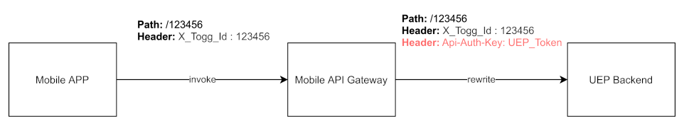

# Creating a Virtual API for the UEP Backend API

[[_TOC_]]

## 1. Description

This document describes how to virtualize UEP backend in Mobile API Gateway.

ETIYA shared the OpenAPI specification [file](res/MOBILEAPP_API_Definition_v1.1%20(openapi_v3_specification).json) for
their UEP backend.

## 2. Environment Model

The UEP Backend API service is a new business service component that is called by all channel clients to let end users
inquire loyalty achievements and status.



Clients:

- The end-users can access and inquire loyalty achievements and status from multiple channels (mobile, car, web, etc.).

Service Providers:

- Mobile API Gateway enriches the incoming request by adding a new header and valu for API Token, then redirects the
  request to UEP Backend API by rewriting.
- UEP Backend API provides loyalty achievements and status information of the users

## 3. Supported Services and Methods

At the moment the following service will be used:

| Method                                        | Request | Response                     |
|-----------------------------------------------|---------|------------------------------|
| `/loyalty/management/inquireLoyalty/{toggId}` | N/A     | LoyaltyMemberProfile message |

## 4. Configurations

Following configuration properties are available for the virtual UEP API:

| Configuration | Description               | Default Value                                                                    | Where       |
|---------------|---------------------------|----------------------------------------------------------------------------------|-------------|
| Api-Auth-Key  | Configures UEP API Key    | JDJhJDEwJDM4YWhxeTIyS2VvSEVXUTNETmRrbHVNTVd0YWE1Q3lkdW92SUtTeGhuWEVkb21vcGdzSGN5 | HTTP Header |
| X_Togg_Id     | Configures user's TOGG ID | -                                                                                | HTTP Header |

> **IMPORTANT** Api-Auth-Key header value should be base64 encoded, otherwise APISIX cannot send it

1. `Api-Auth-Key` will be injected at API Gateway using `proxy-rewrite` APISIX plugin
2. `X_Togg_Id` will be set at the mobile app client

### 5 Create API route and upstream in API Gateway

Create upstream for this microservice:

```json
{
  "nodes": [
    {
      "host": "oab-api-dev.togg.com.tr",
      "port": 443,
      "weight": 1
    }
  ],
  "timeout": {
    "connect": 6,
    "read": 6,
    "send": 6
  },
  "type": "roundrobin",
  "scheme": "https",
  "pass_host": "node",
  "name": "UEP"
}
```

Create route for this microservice:

```json
{
  "uris": [
    "/mobileapp-rest/*"
  ],
  "name": "UEP",
  "desc": "UEP mobile app routes",
  "methods": [
    "GET",
    "POST",
    "PUT",
    "DELETE",
    "PATCH",
    "HEAD",
    "OPTIONS",
    "CONNECT",
    "TRACE"
  ],
  "plugins": {
    "proxy-rewrite": {
      "headers": {
        "Api-Auth-Key": "JDJhJDEwJDM4YWhxeTIyS2VvSEVXUTNETmRrbHVNTVd0YWE1Q3lkdW92SUtTeGhuWEVkb21vcGdzSGN5"
      }
    }
  },
  "upstream_id": "375098364670247690",
  "status": 1
}
```

## 5. Test

You can test with the following curl statement:

```shell
curl -L -X GET 'https://mobile-api-gateway.development.togg.cloud:7443/mobileapp-rest/loyalty/management/inquireLoyalty/68446844' \
-H 'X_Togg_Id: 68446844'
```

## 6. Additional Resources

- [APISIX proxy-rewrite plugin](https://apisix.apache.org/docs/apisix/plugins/proxy-rewrite/)
